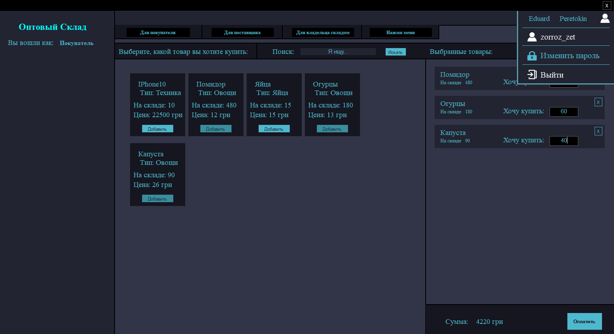
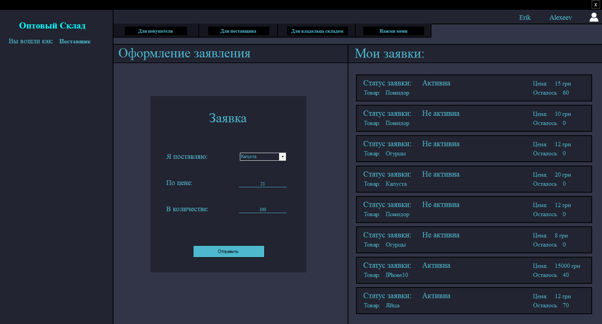
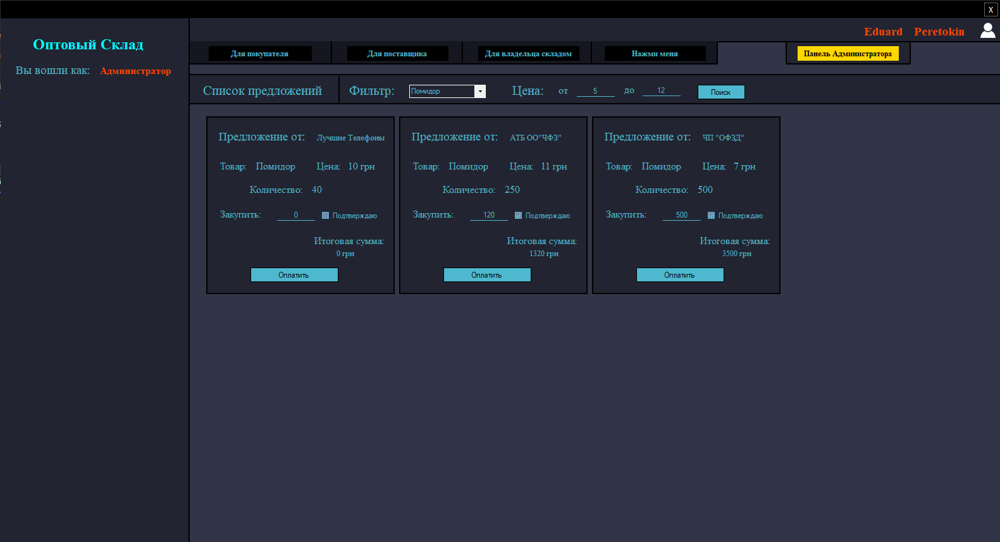
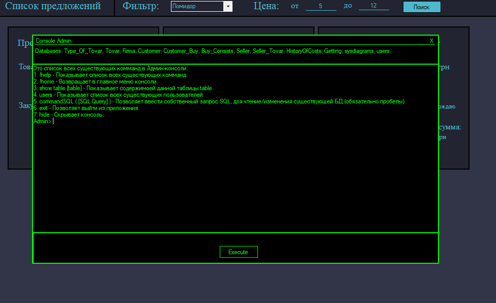

# Ware House

It is a C# Windows Forms Application that works with Database on Microsoft SQL Server.

## Usage

- Load the .mdf database file into your SQL Server
- Change the Connection String In Login.cs
- Run the solution

## Information

This is an old project developed at the university. The main idea is that there are 3 types of users:
 - Buyer
 - Provider
 - Warehouse owner

The **buyer** can purchase the existing goods from the warehouse at a price that is offered directly by the warehouse itself.

  

The **provider** can form an application stating that he is ready to deliver the goods specified by him in the specified quantity to the warehouse.

  

The **warehouse owner** can view the existing orders of suppliers, also monitor the dynamics of prices for selected goods and, as necessary, buy goods that are profitable for him from suppliers in any desired quantity.

  

## Other Staff
**Login**

  

**Admin Console**

  

